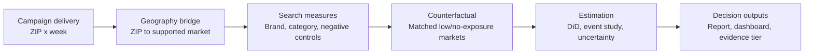

# Critical assessment of the proposed plan

# 2.1 What is strong in the original proposal

- It connects exposure geography to a consumer behavior outcome that is not limited to clicks on the ad itself.

- It creates an executive-friendly “halo” narrative: paid reach may stimulate later branded information seeking.

- It naturally supports a map and time-series visualization.

- It can be applied retrospectively when a randomized holdout was not designed before launch.

- It encourages a repeatable methodology rather than a one-off client story.

# 2.2 The central feasibility problem: public Google Trends is not a ZIP time-series source

Google describes Trends as an anonymized, categorized and aggregated sample of actual searches, with public geography down to city-level. The regional interface exposes regions, cities and, in some countries, metros; the official documentation does not provide ZIP-code time series \[1-2\]. The alpha API is still limited-access and documents region/subregion output, not a production guarantee of U.S. ZIP-level data \[4\].

<table>
<colgroup>
<col style="width: 1%" />
<col style="width: 98%" />
</colgroup>
<thead>
<tr class="header">
<th></th>
<th>
<strong>Adopted change</strong>

Retain the ZIP-level delivery map, but estimate branded-search lift at the smallest stable supported geography. A ZIP selection may filter delivery details and identify the parent analysis geography; it must not display a fabricated ZIP-specific Trends lift.
</th>
</tr>
</thead>
<tbody>
</tbody>
</table>

# 2.3 Google Trends values require careful interpretation

| **Issue**                  | **Why it matters**                                                                                                                                                         | **Design response**                                                                                  |
|----------------------------|----------------------------------------------------------------------------------------------------------------------------------------------------------------------------|------------------------------------------------------------------------------------------------------|
| **Relative, not absolute** | Each point is normalized to all searches in its geography/time and the public UI scales results 0-100. Equal values in two regions do not imply equal search counts \[1\]. | Use within-request ratios or scale-invariant changes; label the metric “relative search interest.”   |
| **Low-volume suppression** | Low-volume terms can appear as zero, and statistical noise is most noticeable when interest is low \[1\].                                                                  | Pretest candidate terms and geographies; coarsen geography/time rather than impute a result.         |
| **Sampling variability**   | Repeated downloads can differ, especially for low-frequency terms \[12-14\].                                                                                               | Repeat retrievals, aggregate medians, store every pull and quantify retrieval variability.           |
| **Query semantics**        | Terms do not automatically include misspellings, synonyms, plurals or singular variants; topics behave differently \[3\].                                                  | Freeze and document grouped query baskets before examining post-campaign results.                    |
| **Request scaling**        | Separate UI requests are independently scaled.                                                                                                                             | Pull brand and category controls together when possible; otherwise use an anchor-stitching protocol. |

# 2.4 Targeting is not delivery

A targeted ZIP list shows where a campaign was configured to run. It does not prove that residents received comparable exposure. Inventory, pacing, audience availability and channel delivery can create substantial differences. The treatment measure must therefore be based on actual impressions/reach by geography and week, with target geography retained as a planning field rather than the primary exposure field.

# 2.5 “Organic branded search” needs precise wording

Google Trends reflects Google search activity, not whether the user clicked an organic result, a paid result, a map listing or no result. The client-facing metric should be called branded-search interest. First-party Search Console or analytics data may separately validate organic visibility or site response.

# 2.6 Before/after is not enough

A brand could gain search interest during a campaign because of seasonality, promotions, news, competitor actions or category growth. The proposed method should therefore use both geographic comparisons and category search controls. This produces a practical triple comparison: brand versus category, exposed versus comparison geography, and post versus pre period.

# 2.7 Impression weight is a harder causal question than binary lift

Campaign weight is rarely allocated randomly. Markets with stronger expected demand may receive more budget, and that selection can create a positive weight-response pattern even without a causal dose effect. Modern continuous-treatment DiD research warns that comparing effects across doses requires stronger assumptions than ordinary binary DiD \[9\]. The primary claim should therefore be the exposed-versus-comparison estimate; weight response is secondary unless allocation supports stronger identification.

*Figure 1. Recommended measurement flow. ZIP delivery is aggregated to a defensible search-analysis geography before estimation.*
