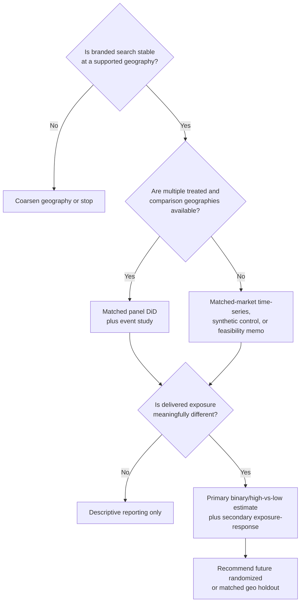

# Measurement framework and calculations

# 4.1 Unit of analysis

| **Geography g** | Smallest stable Google Trends-supported geography that can be linked to delivery: city, metro/market, or state. ZIP remains a delivery/display grain. |
|-----------------|-------------------------------------------------------------------------------------------------------------------------------------------------------|
| **Time t**      | Week by default. Daily data may be a sensitivity test for short flights with strong signal; monthly data is a fallback for sparse terms.              |
| **Treatment**   | Actual delivered campaign exposure, expressed first as exposed versus low/no exposure and second as normalized weight.                                |
| **Outcome**     | Relative branded-search interest divided by relative generic category-search interest, transformed for modeling.                                      |
| **Comparison**  | Matched low/no-delivery geographies with similar pre-campaign search dynamics and relevant market characteristics.                                    |
| **Window**      | A pre-period long enough to assess parallel trends, the campaign period and a post-flight carryover window.                                           |

# 4.2 Query baskets

| **Basket**                  | **Purpose**                                                                  | **Construction rules**                                                                                                                              | **Example placeholder**                                     |
|-----------------------------|------------------------------------------------------------------------------|-----------------------------------------------------------------------------------------------------------------------------------------------------|-------------------------------------------------------------|
| **Brand basket**            | Capture searches specifically attributable to brand awareness/consideration. | Approved brand name, major spelling variants, product/service lines and unambiguous topics. Freeze before post-period inspection.                   | “Client Brand” + “ClientBrand” + approved product term.     |
| **Category basket**         | Control for broad demand, seasonality and category news.                     | Generic non-brand terms with stable volume; exclude terms likely to be directly created by the campaign message. Use multiple terms where possible. | “category service” + “near me category” + “category quote.” |
| **Negative-control basket** | Detect unrelated shocks or pipeline artifacts.                               | Terms with similar seasonality but no plausible campaign mechanism.                                                                                 | Approved unrelated local-service topic.                     |
| **Anchor term**             | Stitch separately scaled pulls only when unavoidable.                        | High-volume, stable term included in each request; not treated as a substantive category control.                                                   | A stable high-volume topic selected in pilot.               |

# 4.3 Retrieval protocol

> **1.** Lock the country, geography, date window, search type, category filter, term/topic identifiers and exact grouped queries in a versioned query registry.
>
> **2.** Pull the brand and category baskets in the same request whenever the interface permits so that the common request scale cancels in their ratio.
>
> **3.** Repeat each retrieval multiple times during the pilot, save every raw export and use the median value by geography/week. The exact repetition count should be selected after the pilot variance check; five or more pulls is a reasonable starting requirement.
>
> **4.** Store retrieval timestamp, interface/API version, request URL or parameter payload, time zone, source filename and checksum in the run manifest.
>
> **5.** Do not fill suppressed zeros with a fabricated value. Coarsen geography, aggregate time or disqualify the term/case when signal is insufficient.
>
> **6.** Re-run a frozen historical retrieval near finalization and compare it with the original retrieval to quantify source revision/sampling sensitivity.

The repeated-pull requirement follows published evidence that low-frequency terms are less reliable and that aggregating multiple samples can stabilize Google Trends series \[12-14\].

# 4.4 Simple executive calculation: ratio of ratios

<table>
<colgroup>
<col style="width: 1%" />
<col style="width: 98%" />
</colgroup>
<thead>
<tr class="header">
<th></th>
<th>
<strong>Client-friendly formula</strong>

Lift = [(Post brand/category index in exposed markets / Pre brand/category index in exposed markets) ÷ (Post brand/category index in comparison markets / Pre brand/category index in comparison markets) - 1] × 100.
</th>
</tr>
</thead>
<tbody>
</tbody>
</table>

This calculation asks whether brand search grew relative to category search in exposed markets, then subtracts the same relative movement observed in comparable unexposed markets. It is easy to audit in a four-cell table and is equivalent to a multiplicative difference-in-differences on the brand/category ratio.

# 4.5 Regression specification

| **Component**       | **Specification**                                                                                                |
|---------------------|------------------------------------------------------------------------------------------------------------------|
| **Search outcome**  | Y(g,t) = ln\[BrandIndex(g,t) / CategoryIndex(g,t)\]                                                              |
| **Primary DiD**     | Y(g,t) = alpha(g) + lambda(t) + beta × Exposed(g) × Post(t) + controls + error(g,t)                              |
| **Percent lift**    | Estimated lift = 100 × \[exp(beta) - 1\]                                                                         |
| **Event study**     | Replace the single Post interaction with week-relative-to-launch indicators; omit one pre week as the reference. |
| **Exposure weight** | Weight(g,t) = impressions(g,t) / targetable population(g) × 1,000, or use reach rate / GRPs when available.      |

The fixed effects absorb stable geography differences and common week shocks. The event-study plot is the primary diagnostic for whether treated and comparison markets were already diverging before launch. Multiple-period DiD and event-study methods require explicit attention to treatment timing, parallel trends and heterogeneous effects \[8\].

## 4.6 Zero and sparse-signal policy

| **Condition**                                     | **Action**                                                                                 | **Permitted interpretation**                  |
|---------------------------------------------------|--------------------------------------------------------------------------------------------|-----------------------------------------------|
| **Occasional zero after otherwise stable signal** | Aggregate to weekly/monthly or use a prespecified robust transform as a sensitivity check. | Directional only unless robustness is strong. |
| **Frequent zeros in brand basket**                | Coarsen geography or expand only preapproved brand variants; rerun feasibility.            | No estimate at the sparse geography.          |
| **Category basket zeros**                         | Replace with a higher-volume approved category basket; do not divide by near-zero values.  | No ratio estimate until control is stable.    |
| **Both stable only at state level**               | Estimate at state level and keep ZIPs as delivery detail.                                  | State-level lift; never ZIP-level.            |

## 4.7 Event timing and carryover

- Use weekly relative-time coefficients to show whether the effect begins at launch, builds with delivery, or appears after repeated exposure.

- Prespecify a carryover window, such as two to four weeks after the flight, based on campaign length and purchase cycle; show alternatives as sensitivity checks.

- Annotate promotions, PR, store openings, website outages, competitor events, holidays and major local shocks on the chart.

- For campaigns with ramped starts or staggered market activation, use the actual first material-delivery week by geography rather than a single planning date.

# 4.8 Impression-weight response

| **Step**            | **Required calculation**                                                                             | **Interpretation rule**                                                         |
|---------------------|------------------------------------------------------------------------------------------------------|---------------------------------------------------------------------------------|
| **Normalize**       | Prefer reach rate or GRPs. Otherwise compute impressions per 1,000 targetable households/population. | Raw impression totals are not comparable across geography size.                 |
| **Create contrast** | Define no/low/medium/high bins before examining lift, or use prespecified quantiles.                 | Binned results are easier to explain and less sensitive to functional form.     |
| **Estimate**        | Plot adjusted lift by bin; optionally fit a monotonic or spline response with uncertainty.           | The slope is secondary unless weight allocation is plausibly exogenous.         |
| **Check selection** | Compare pre-period search, market size and campaign objectives across weight bins.                   | Large baseline differences weaken causal dose language.                         |
| **Report**          | Use “response associated with delivered weight” unless stronger design assumptions are supported.    | Do not automatically say each additional impression caused the observed change. |

*Figure 2. Method-selection decision tree. A standard DiD is only one branch; sparse or few-geography cases require another design or a no-go decision.*
