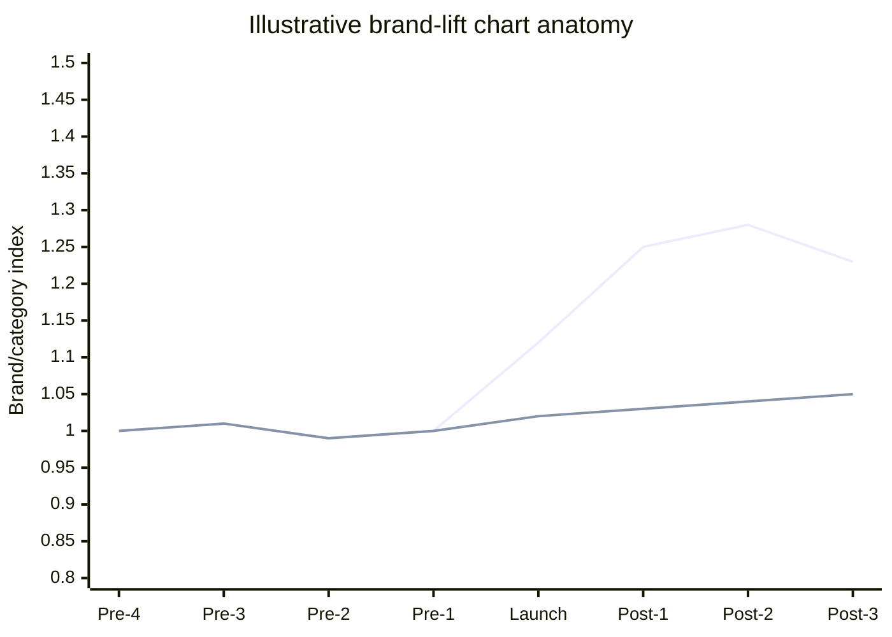

# Dashboard and report specifications

# 8.1 Halo Explorer information architecture

| **Page**                  | **Purpose**                                                 | **Required elements**                                                                                                                |
|---------------------------|-------------------------------------------------------------|--------------------------------------------------------------------------------------------------------------------------------------|
| **1. Executive Summary**  | Answer the business question in under one minute.           | Estimated lift, interval, evidence tier, campaign dates, treated/comparison count, key limitation, observed vs counterfactual chart. |
| **2. Delivery Footprint** | Show where and how heavily the campaign actually delivered. | ZIP/ZCTA map, parent market boundary, impressions, reach, frequency, spend, mapping coverage and leakage.                            |
| **3. Search Lift**        | Show timing and the counterfactual.                         | Brand/category trend, event-study coefficients, campaign shading, external-event annotations, comparison selector.                   |
| **4. Impression Weight**  | Show whether response increases with normalized exposure.   | No/low/medium/high bins, adjusted lift, uncertainty, sample size and selection caveat.                                               |
| **5. Methods & QA**       | Make the number auditable.                                  | Query baskets, geography level, period, source dates, control method, pre-trend/placebo results, evidence tier, limitations.         |

## 8.2 Filter and interaction rules

- Client and campaign are top-level selectors; changing them loads a versioned configuration rather than changing formulas.

- A ZIP selector filters delivery metrics and highlights the ZIP/ZCTA approximation. The lift KPI explicitly states the parent analysis geography.

- A geography selector offers only levels that passed signal and mapping gates.

- A query-basket selector is available only in the internal methods view; the client view shows the approved basket label, not raw exploratory alternatives.

- Every KPI includes an information tooltip with definition, source and latest refresh.

- The dashboard displays “insufficient evidence” rather than zero lift when signal or model gates fail.

## 8.3 ZIP interaction example

| **User action**     | **What appears**                                                                                                     | **Required label**                                                           |
|---------------------|----------------------------------------------------------------------------------------------------------------------|------------------------------------------------------------------------------|
| **Click ZIP 28202** | Actual ZIP-level delivered impressions/reach/frequency; mapped parent market; local contribution to parent exposure. | “Delivery shown for ZIP/ZCTA approximation.”                                 |
| **View lift KPI**   | Lift estimate for the selected parent market or pooled treated markets.                                              | “Search lift estimated at \[metro/market/state\] level; not a ZIP estimate.” |
| **Compare ZIPs**    | Side-by-side delivery and parent-market assignment.                                                                  | Do not rank ZIPs by unsupported search lift.                                 |

# 8.4 Executive report template

| **Page** | **Headline question**                             | **Content**                                                                                                 |
|----------|---------------------------------------------------|-------------------------------------------------------------------------------------------------------------|
| **1**    | What happened?                                    | One-sentence finding, lift point estimate and interval, evidence tier, campaign footprint and major caveat. |
| **2**    | Where did the campaign deliver?                   | Map of actual delivery and normalized weight; target versus delivered differences.                          |
| **3**    | Did branded search outperform the counterfactual? | Observed and counterfactual brand/category trend with campaign shading.                                     |
| **4**    | Was the timing consistent with campaign response? | Event-study/pre-trend chart and external-event annotations.                                                 |
| **5**    | Did more weight correspond to more response?      | Binned reach/impression-weight result and selection caveat.                                                 |
| **6**    | How confident are we?                             | Methods summary, robustness matrix, evidence tier and what the estimate does not measure.                   |

*Figure 3. Illustrative chart anatomy only. The final chart must include uncertainty, campaign timing, and values from the governed model-output table.*

## 8.5 Required result wording

| **Evidence tier**                           | **Permitted headline**                                                                                 | **Required qualifier**                                                                  |
|---------------------------------------------|--------------------------------------------------------------------------------------------------------|-----------------------------------------------------------------------------------------|
| **Tier 1 - Strong quasi-experimental**      | “The campaign is estimated to have generated X% incremental branded-search lift.”                      | Include interval, analysis geography, period and major assumption.                      |
| **Tier 2 - Directional quasi-experimental** | “Branded-search interest was estimated to be X% higher than the comparison trend during the campaign.” | Use “directional,” list unresolved limitations and avoid precision beyond the interval. |
| **Tier 3 - Descriptive**                    | “Branded-search interest increased X% during the campaign period relative to the selected benchmark.”  | State that the analysis does not establish incremental causal lift.                     |

## 8.6 Required footnote

<table>
<colgroup>
<col style="width: 1%" />
<col style="width: 98%" />
</colgroup>
<thead>
<tr class="header">
<th></th>
<th>
<strong>Client-facing measurement note</strong>

Google Trends represents normalized relative search interest from a sampled, aggregated source. It does not report absolute search counts, organic clicks, conversions or sales. The estimate is reported at the stated analysis geography and depends on the comparison-market and parallel-trends assumptions.
</th>
</tr>
</thead>
<tbody>
</tbody>
</table>
